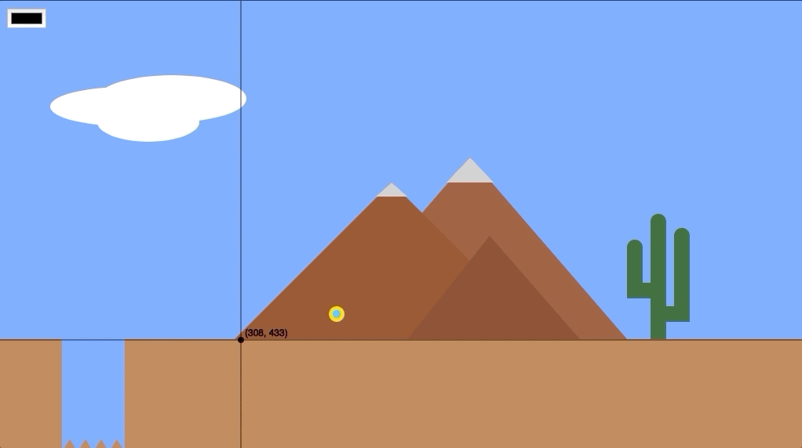

# tool5
Chrome extension to help the development of p5.js apps.

Placing elements exactly where you want in the canvas can be a daunting trial and error task.

The goal of this tool is to help you achieve that more easily by allowing you to visualize the mouse coordinates on the canvas that you're currently working on.

## Usage (developer mode)

Clone/download the repository.

Open the extensions page of the Chrome browser by entering `chrome://extensions/` in the search.

Enable `developer mode`.

Click on the `Load unpacked` button and select the folder of the repository where you downloaded it. 

Make sure the extension is enabled and have fun!

## Development

This current version only shows the coordinates of the mouse on canvas.

However, my goal is to implement the drawing functionalities of the 2D primitive shapes of p5.js and display the coordinates.

I would love if you are interested in contributing to this project.